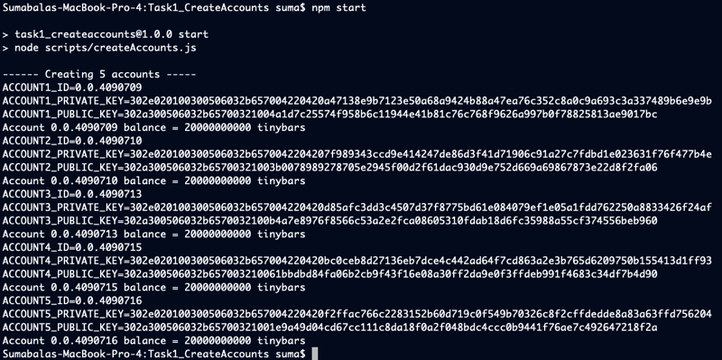

# Task 1

## Problem

Create a script to generate 5 Hedera Testnet accounts (Account1, Account2, Account3, Account4 and Account5). Use these accounts as indicated in the following tasks.
These accounts must not already exist before the start of the test.
Be sure to note down the account Id and keys of the accounts – you will need these later. You will also need to communicate these
account IDs during your response to the certification test.
Fund the accounts as you see appropriate to cover the costs of your tasks.
## Prerequisites

- This code was tested using node v19.8.1 (npm 9.5.1), but should work with node versions 18 and up
- In the current folder (Task1_CreateAccounts), run `npm install`
- rename sample.env file to .env and fill the values for the environment variables (Note: An external account is required). An account id, private key and a number denoting number of accounts to be created are expected.

## Running the code
- run command `npm start`

## Outputs

