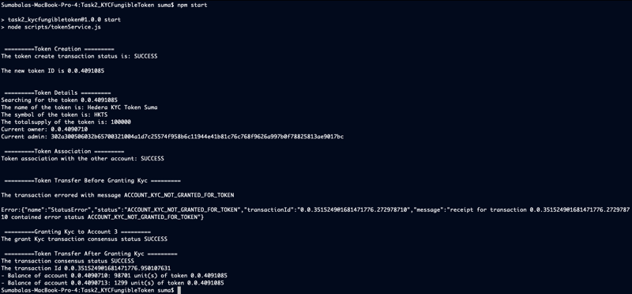

# Task 1

## Problem

Create a script that generates a fungible token that requires a KYC process to be completed.
Set a fixed supply of 1000. Associate Account3, but do not KYC it.

Try to send 12.99 tokens from Account2 to Account3.
Show that the account is not yet able to participate in the token because it is not been KYC approved.

Now set the KYC flag on Account3 and retry the transfer.

## Prerequisites

- This code was tested using node v19.8.1 (npm 9.5.1), but should work with node versions 18 and up
- In the current folder (Task2_KYCFungibleToken), run `npm install`
- rename sample.env file to .env and fill the values for the environment variables (Note: An external account is required). An account id, private key and a number denoting number of accounts to be created are expected.

## Running the code
- run command `npm start`

## Outputs

