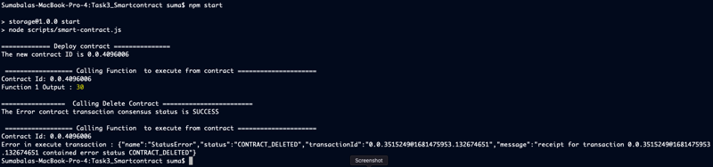

# Task 3

## Problem

Compile the Solidity contract given below using Account1 and deploy it to the Hedera Network using
the HCS with the ContractCreateFlow method. Write a script to call “function1” with the parameters 5 and 6.
Gather the result and display it in the output. Delete the smart contract.

## Prerequisite

- This code was tested using node v19.8.1 (npm 9.5.1), but should work with node versions 18 and up
- In the current folder (Task3_Smartcontract), run `npm install`
- rename sample.env file to .env and fill the values for the environment variables 
- CertificationC1.json is expected to be present in build/contracts folder

## Running the code

run command `npm start`

## Output

