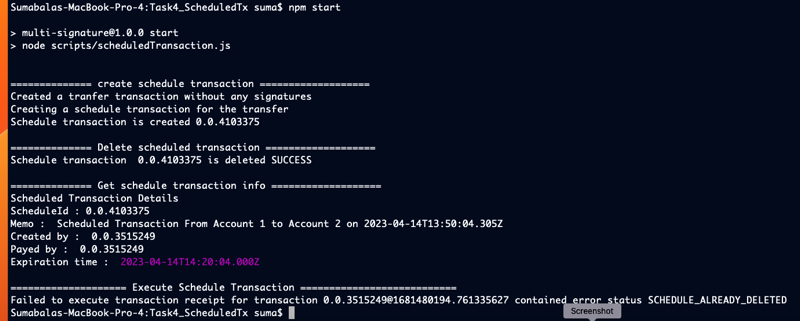

# Task 4

## Problem

Create a script that creates a scheduled transaction of 2 hbar from
Account1 to Account2.
Make a second script that deletes the transaction.
Print out the schedule information along the way along with the
proof that the transfer did not happen.
Try to execute the transaction and show that it does not work.

## Prerequisites

- This code was tested using node v19.8.1 (npm 9.5.1), but should work with node versions 18 and up
- In the current folder (Task4_ScheduledTx), run `npm install`
- rename sample.env file to .env and fill the values for the environment variables 

## Running the code

run command `npm start`

## Output

