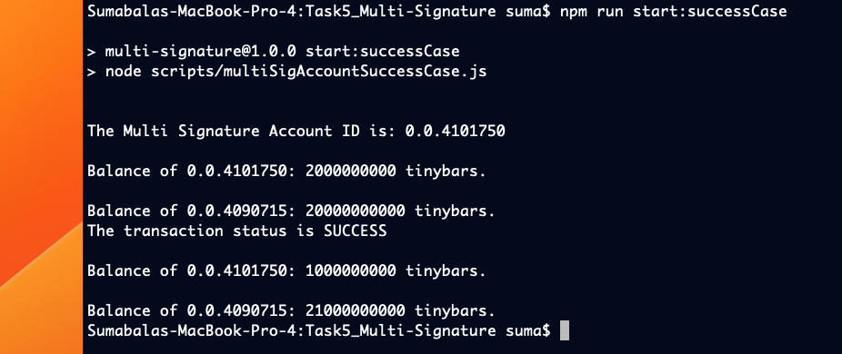

# Task : Multi Signature

Create a scheduled transaction with a key list with 3 key Account1, Account2 and Account3 ) that requires 2 of the three
keys.
Sign the transaction with Account1 . Get the information of the transaction and show that it has not yet been executed.
Sign the transaction with Account2 and get the information again to show that it has been executed.

## Prerequisites

- This code was tested using node v19.8.1 (npm 9.5.1), but should work with node versions 18 and up
- In the current folder (Task5_Multi-Signature), run `npm install`
- rename sample.env file to .env and fill the values for the environment variables (Note: An external account is required). An account id, private key and a number denoting number of accounts to be created are expected.

## Running the code
- run command `npm run start:failureCase` to see the scenario where only Account 1 signs, leading to a transaction failure
- run command `npm run start:successCase` to see the scenario where both Account 1 and Account 2 sign, leading to a transaction success

## Outputs
-  
-  

