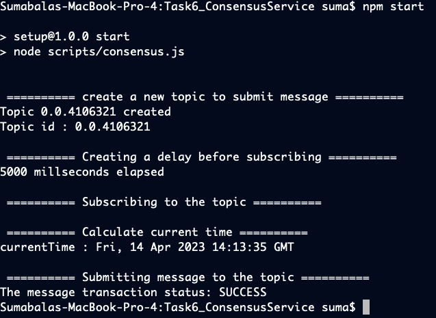

# Task 6

## Problem

Create a script to create a consensus transaction on the Hedera
Consensus Service using Account1. Write the current time in the
message of the transaction and submit.

## Prerequisites

- This code was tested using node v19.8.1 (npm 9.5.1), but should work with node versions 18 and up
- In the current folder (Task6_ConsensusService), run `npm install`
- rename sample.env file to .env and fill the values for the environment variables (Note: An external account is required). An account id, private key and a number denoting number of accounts to be created are expected.

## Running the code
  run command `npm start`

## Output

